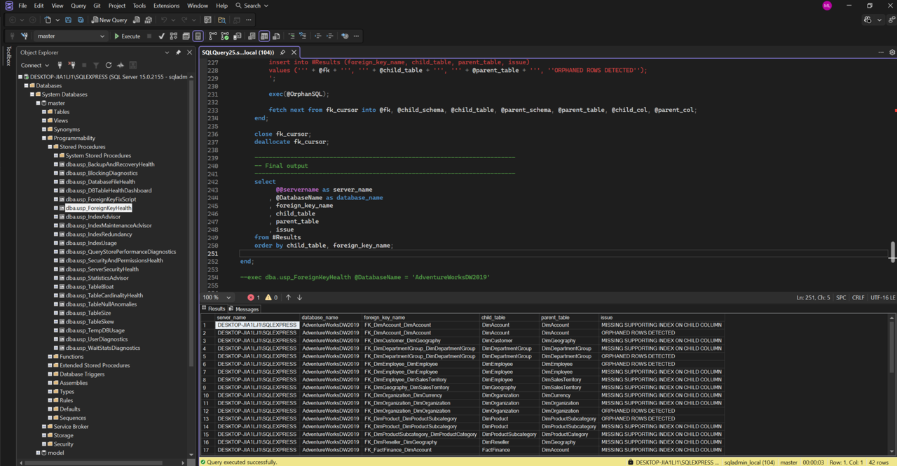

# 🛢️🔧 SQL Server Database Tools

This folder is part of the Gulf to Bay Analytics modernization project.  
It contains SQL Server–focused **database administration and diagnostics tools**, designed to deliver a clean, automated, cloud‑ready operational foundation.

## Purpose

This folder contributes to the modernization effort by organizing **DBA‑grade stored procedures** that provide:

- Health diagnostics  
- Performance insights  
- Metadata analysis  
- Evidence‑driven recommendations  
- Safe, review‑first remediation scripts  

Each procedure is built to be **DB‑agnostic**, **deterministic**, and **GTB‑aligned**, supporting both on‑prem SQL Server and Azure SQL Database environments.

## Contents

This folder may include:

- Stored procedures for:
  - Index tuning and governance  
  - Foreign key integrity  
  - Table and storage health  
  - TempDB usage  
  - Blocking and wait stats diagnostics  
  - Query Store performance insights  
  - Security and user diagnostics  
- Supporting SQL artifacts  
- Evidence queries and helper utilities  
- Modular components used across the DBA toolkit

## Modernization Context

As part of the end‑to‑end modernization, this folder helps ensure:

- Clean separation of DBA tooling from application SQL  
- Consistent, professional, recruiter‑ready documentation  
- A unified diagnostics layer across all SQL Server environments  
- Evidence‑driven, review‑first operational workflows  
- A modern, cloud‑aligned approach to database administration

These tools form the backbone of the **Gulf to Bay Analytics DBA Modernization Toolkit**, enabling reliable operations, transparent diagnostics, and platform‑wide observability.

### 🛢️🔧 SQL Server Database Tools - Foreign Key Health
