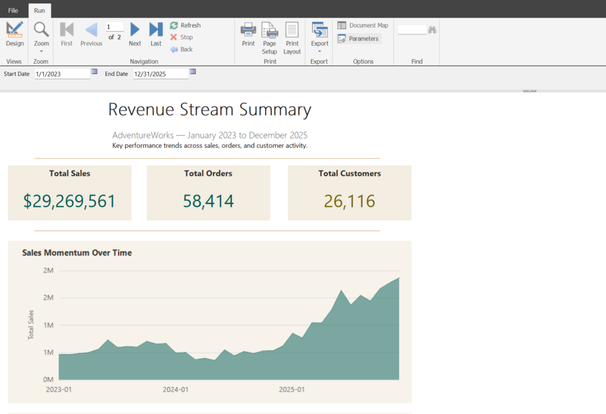

# 📈 SSRS

This folder is part of the Gulf to Bay Analytics modernization project.  
It contains assets, scripts, or resources related to **SQL Server Reporting Services (SSRS)**, aligned with the overall goal of creating a clean, automated, cloud‑ready analytics ecosystem.

## Purpose

This folder contributes to the modernization effort by organizing work related to **paginated reporting, RDL development, and enterprise reporting patterns** in a clear, maintainable structure.

## Contents

This folder may include:
- SSRS report definition files (`.rdl`)
- Report assets
- Supporting documentation

## Modernization Context

As part of the end‑to‑end modernization, this folder helps ensure:
- Clean separation of reporting artifacts
- Improved maintainability
- Consistent documentation
- Recruiter‑ready project organization

### 📈 SSRS 
