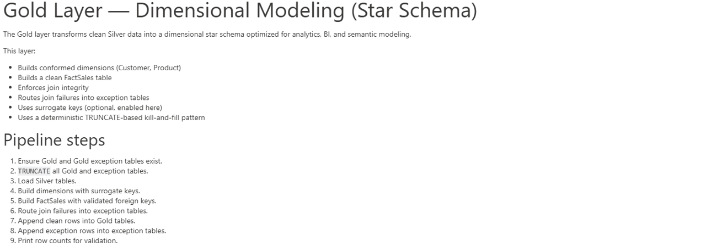
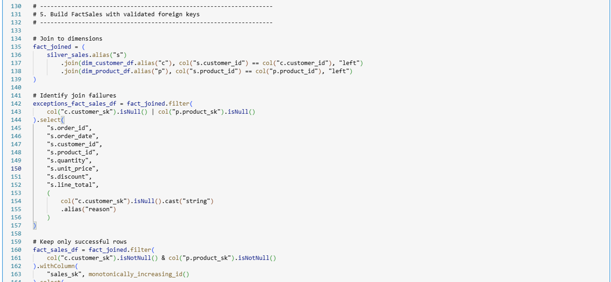
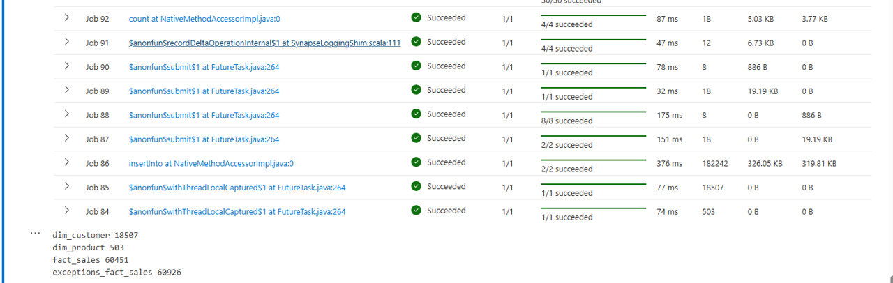

# 🔄 Fabric Lakehouse

This folder is part of the Gulf to Bay Analytics modernization project.  
It contains assets, scripts, or resources related to the **Microsoft Fabric Lakehouse**, aligned with the overall goal of creating a clean, automated, cloud‑ready analytics ecosystem.

## Purpose

This folder contributes to the modernization effort by organizing work related to **medallion‑layer engineering, notebook‑driven transformations, pipeline orchestration, configuration, and semantic modeling** in a clear, maintainable structure.

## Contents

This folder may include:
- Configuration files for environment behavior and refresh schedules  
- Notebooks for raw, bronze, silver, and gold data processing  
- Fabric pipelines for orchestration and automation  
- Semantic model definitions and deployment scripts  
- Supporting assets  

## Modernization Context

As part of the end‑to‑end modernization, this folder helps ensure:
- Clean separation of medallion‑layer responsibilities  
- Improved maintainability across ingestion, transformation, and modeling  
- Consistent documentation across all Fabric components  
- Recruiter‑ready project organization that reflects modern data engineering practices  

### 🔄 Fabric Python Notebooks

### 🔄 Fabric Pipelines
