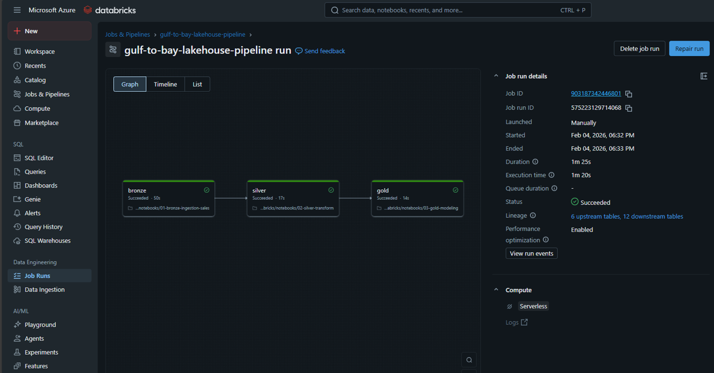

# 🔄 Databricks — Gulf to Bay Lakehouse Modernization

This folder contains the full Databricks implementation of the Gulf to Bay Lakehouse modernization effort.  
It includes both the **notebook‑driven medallion architecture** and the **Databricks Job** that orchestrates the Bronze → Silver → Gold pipeline.

The Databricks layer mirrors the Fabric Lakehouse implementation, providing a cloud‑agnostic, engineering‑friendly modernization path.

---

## Folder Structure

### `10-databricks-notebooks/`
Implements the three medallion layers:

- **01-bronze-ingestion-sales**  
  Raw ingestion from CSV into Delta Bronze tables.

- **02-silver-transform**  
  Cleansing, standardization, and conformance into Silver tables.

- **03-gold-modeling**  
  Dimensional modeling and analytics‑ready Gold tables.

These notebooks are written in a clean, deterministic style with minimal markdown and clear inline comments.

---

### `10-databricks-jobs/`
Contains the **job definition JSON** for the Databricks Lakehouse Pipeline:

- Task graph (bronze → silver → gold)  
- Notebook paths  
- Dependencies  
- Performance settings  
- Queueing behavior  

This JSON file documents the orchestration layer and provides a reproducible specification for recreating the job in any Databricks workspace.

---

## Purpose of This Layer

The Databricks portion of the repo demonstrates:

- A complete **Lakehouse medallion architecture**  
- Notebook‑driven ETL/ELT pipelines  
- Databricks Workflows orchestration  
- Delta Lake storage patterns  
- Cloud‑native modernization aligned with enterprise engineering practices  

This layer complements the Fabric Lakehouse implementation, showing that the Gulf to Bay modernization can run on either platform.

---

## How the Pieces Fit Together

1. **Raw data** (CSV exports from Azure SQL) is ingested by the Bronze notebook.  
2. **Silver** applies cleaning, standardization, and schema alignment.  
3. **Gold** produces dimensional models and fact tables for analytics.  
4. The **Databricks Job** orchestrates all three notebooks in sequence.  
5. The output tables become the foundation for downstream BI and semantic modeling.

---

## Relationship to the Overall Repo

This folder integrates with:

- `01-sql-server/` — original SQL Server + Azure SQL sources  
- `15-lakehouse-expansion/` — Fabric Lakehouse implementation  
- `docs/` — architecture diagrams and modernization notes  

Together, these components form a complete, end‑to‑end modernization narrative across SQL Server, Fabric, and Databricks.

---

## Notes

- No schedules are enabled to avoid unintended compute usage.  
- All notebooks and job definitions are version‑controlled for reproducibility.  
- The Databricks layer is intentionally lightweight, focusing on clarity and modernization patterns rather than platform‑specific complexity.

### 🔄 Databricks Notebooks

### 🔄 Databricks Jobs
