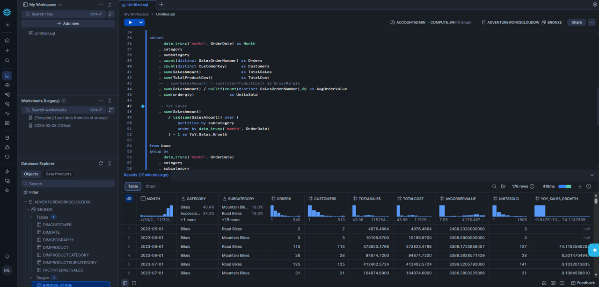
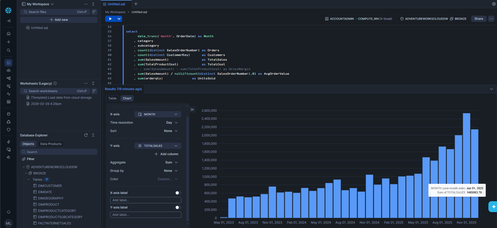

# ❄️ Snowflake — GTB Analytics Modernization (Bronze Foundations)

This module captures the initial Snowflake build‑out for the Gulf‑to‑Bay Analytics Modernization project. It establishes a clean, reproducible baseline for ingesting raw CSV exports from AdventureWorks into Snowflake’s **Bronze** layer, validating the platform, and preparing for future Silver/Gold transformations or dbt‑driven modeling.

The goal of this folder is not to deliver a full warehouse, but to document a **minimal, working Snowflake footprint** that demonstrates platform fluency, ingestion patterns, and query‑ready dimensional data.

---

## Scope and Objectives

This Snowflake segment focuses on:

- Creating a dedicated database and schema (`ADVENTUREWORKSCLOUDDW.BRONZE`)
- Staging raw CSV files using an internal Snowflake stage
- Loading each file into a Bronze table using Snowsight’s “Create Table from File” workflow
- Normalizing column names and removing header rows when Snowflake does not auto‑detect them
- Applying light type cleanup (numeric keys, dates, measures)
- Running analytical SQL with parameter blocks, rollups, and reusable measures

This is intentionally lightweight: the emphasis is on **clean ingestion, clarity, and queryability**, not full transformation logic.

---

## Folder Contents

- **/sql/**  
  Ad‑hoc SQL used during ingestion, cleanup, and exploration. Includes:
  - Column rename scripts  
  - Header‑row cleanup  
  - Type normalization  
  - Parameter‑driven analytical queries  

- **/staging/**  
  Notes and references for the internal stage (`BRONZE_STAGE`) used to load CSVs.

- **/docs/**  
  Short notes on Snowflake UI behavior, header detection quirks, and ingestion patterns.

---

## Bronze Layer Overview

The following tables were ingested from CSV and lightly cleaned:

- `bronze.dimcustomer`
- `bronze.dimdate`
- `bronze.dimgeography`
- `bronze.dimproduct`
- `bronze.dimproductsubcategory`
- `bronze.dimproductcategory`
- `bronze.factinternetsales`

Each table follows the same pattern:

1. Load raw CSV into Snowflake via Snowsight  
2. Rename auto‑generated `C1, C2, …` columns to real column names  
3. Delete the header row if imported as data  
4. Convert key and measure columns to numeric types where applicable  

This produces a **query‑ready Bronze layer** suitable for exploration and downstream modeling.

---

## Query Patterns

This module includes a reusable SQL pattern built around:

- A **parameter block** at the top of each query  
- Consistent filters for geography, product hierarchy, and date ranges  
- Clean star‑schema joins across the Bronze tables  
- Analytical measures such as:
  - Total Sales  
  - Orders  
  - Customers  
  - Units Sold  
  - Gross Margin  
  - Average Order Value  
  - YoY Sales Growth  

These queries serve as a foundation for future Silver/Gold modeling or a dbt project.

---

## Future Expansion

This Snowflake footprint is intentionally minimal but sets the stage for:

- A full **Silver** layer with typed, conformed dimensions  
- A **Gold** star schema for BI consumption  
- A dbt project for governed, testable SQL transformations  
- Snowflake **Semantic Views** for business entities and metrics  
- Power BI semantic model connected via the native Snowflake connector  

---

## Status

This folder represents a **working, validated Bronze ingestion pipeline** and a set of analytical SQL patterns. It is not a full warehouse implementation, but it provides a clean, modern foundation for future expansion within the GTB modernization narrative.

### ❄️ Snowflake - Analysis Table

### ❄️ Snowflake - Analysis Chart
