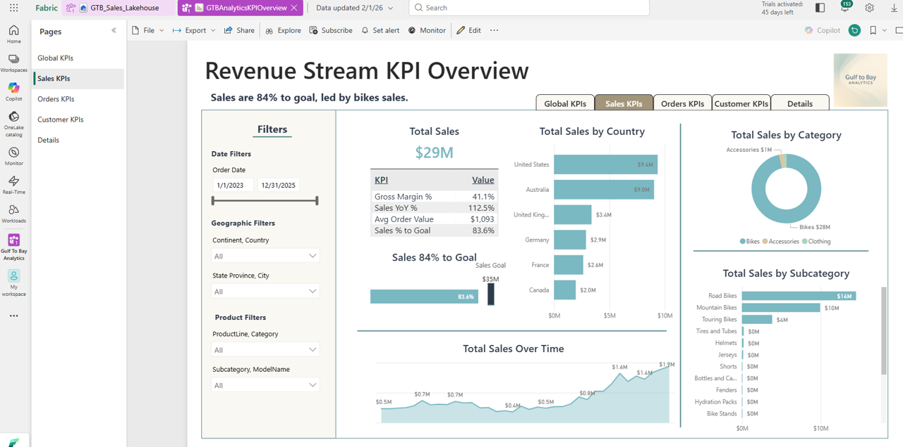
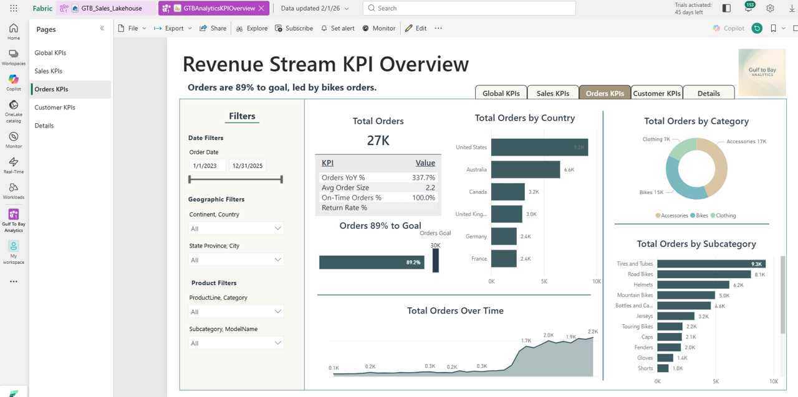
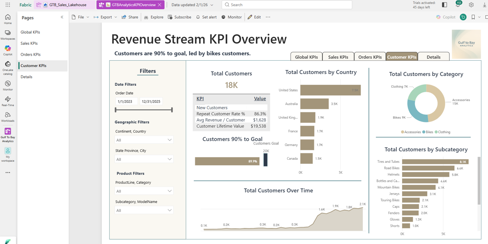
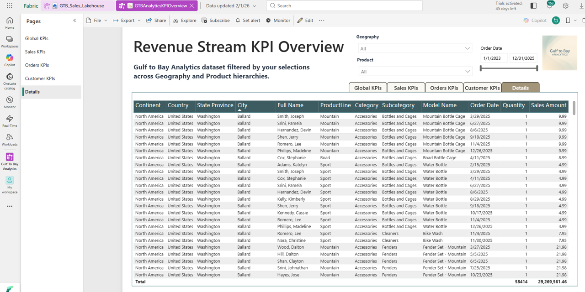
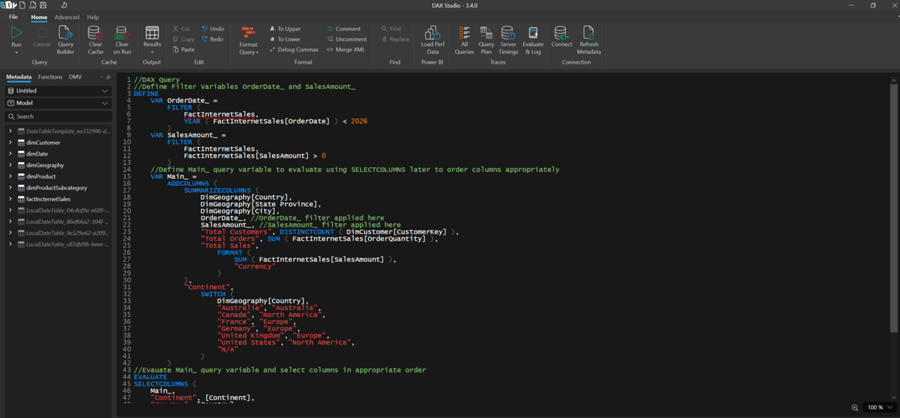

# 📈 Power BI

This folder is part of the Gulf to Bay Analytics modernization project.  
It contains assets, scripts, or resources related to **Power BI**, aligned with the overall goal of creating a clean, automated, cloud‑ready analytics ecosystem.

## Purpose

This folder contributes to the modernization effort by organizing work related to **report development, theming, M‑based transformations, and semantic model alignment** in a clear, maintainable structure.

## Contents

This folder may include:
- Power BI theme JSON files  
- M transformation scripts  
- PBIX report files  
- Supporting assets  

## Modernization Context

As part of the end‑to‑end modernization, this folder helps ensure:
- Clean separation of report artifacts  
- Improved maintainability  
- Consistent documentation  
- Recruiter‑ready project organization  

### 📈 Power BI Revenue Stream KPI Overview

<strong>Gulf-To-Bay Analytics Revenue Stream KIP Overview</strong> Available to Public at: https://app.powerbi.com/view?r=eyJrIjoiMzcyYTIzN2EtYzBjNi00MmY5LWJhY2UtZDk5MDkyZTYwNDExIiwidCI6ImE0MzI2YTU4LWY3ZDktNDQ0ZC1iM2FhLWIwOTAyN2U1ZTg2NiIsImMiOjF9

<strong>📈 Revenue Stream KPI Overview - Global KPIs</strong>

<strong>📈 Revenue Stream KPI Overview - Sales KPIs</strong>

<strong>📈 Revenue Stream KPI Overview - Orders KPIs</strong>

<strong>📈 Revenue Stream KPI Overview - Customer KPIs</strong>

<strong>📈 Revenue Stream KPI Overview - Details</strong>

<strong>📈 DAX</strong>
