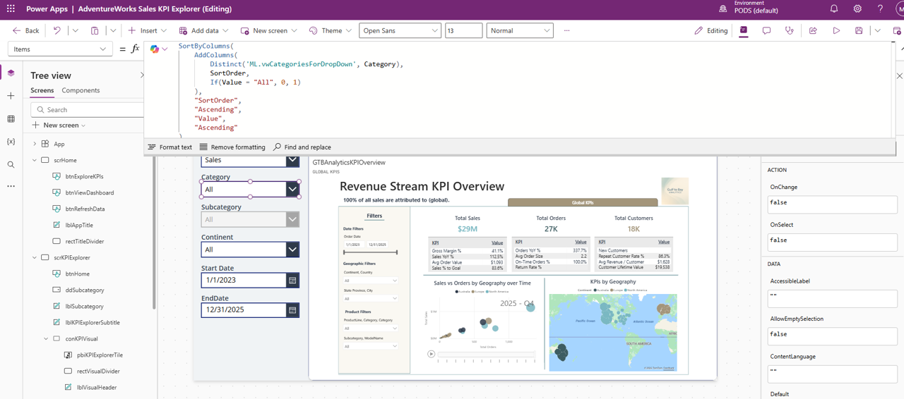
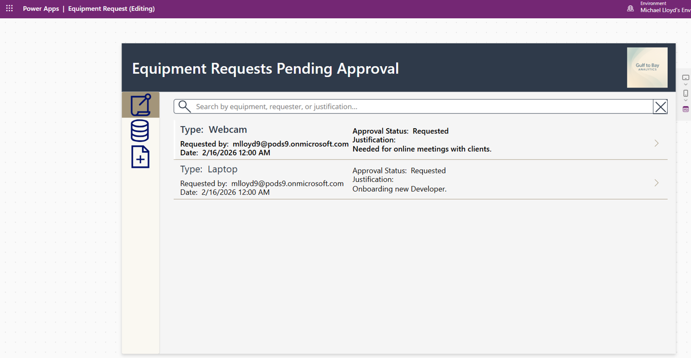
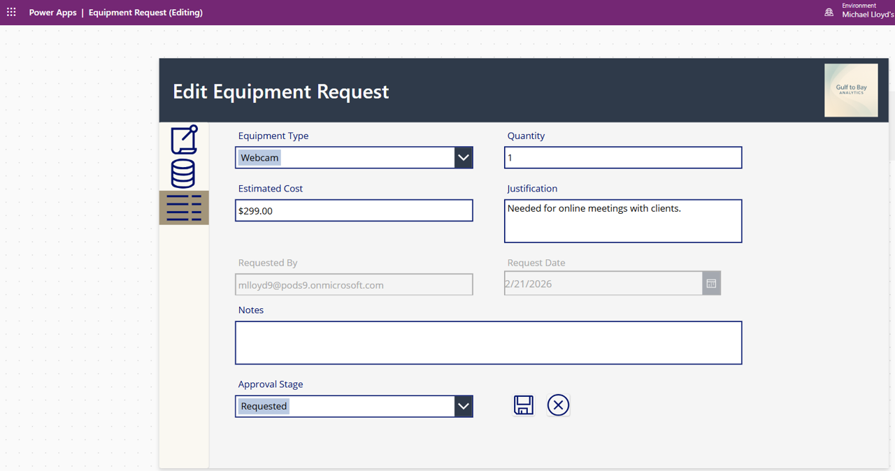
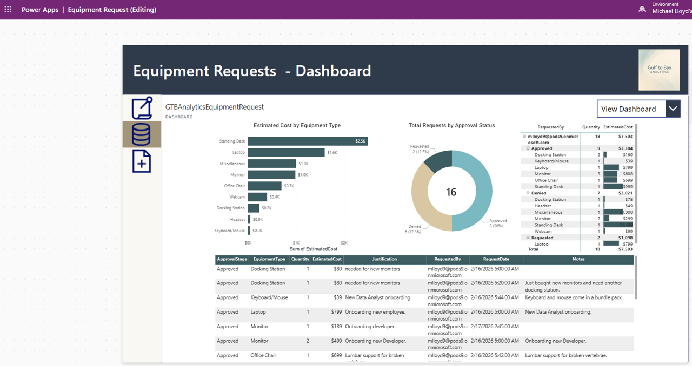
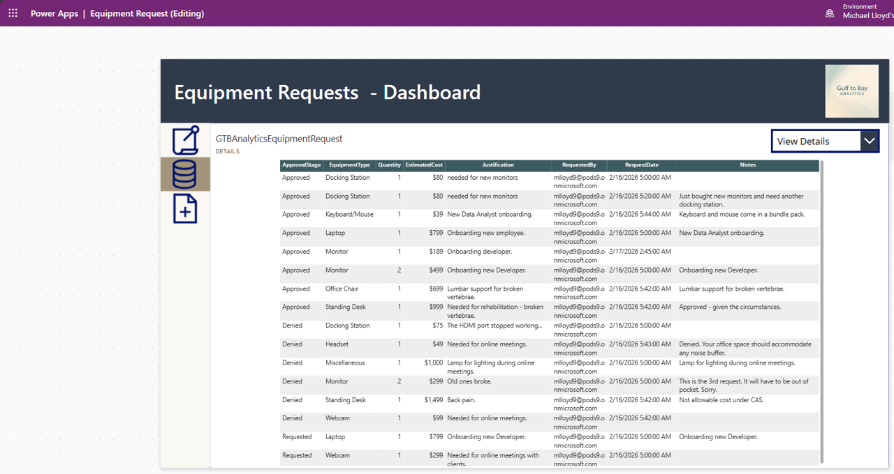

# 📱 Power Apps

This folder is part of the Gulf to Bay Analytics modernization project.  
It contains assets, scripts, or resources related to **Microsoft Power Apps**, aligned with the overall goal of creating a clean, automated, cloud‑ready analytics ecosystem.

## Purpose

This folder contributes to the modernization effort by organizing work related to **canvas app development, UI logic, data integration, and solution packaging** in a clear, maintainable structure.

## Contents

This folder may include:
- Canvas app source files  
- Unpacked Power Apps artifacts  
- Themed assets and UI resources  
- Supporting documentation  

## Modernization Context

As part of the end‑to‑end modernization, this folder helps ensure:
- Clean separation of app components  
- Improved maintainability  
- Consistent documentation  
- Recruiter‑ready project organization  

### 📱 Power Apps

<strong>📱 Revenue Stream KPI Overview - Global KPIs</strong>

<strong>📱 Equipment Requests - Pending Approval</strong>

<strong>📱 Equipment Requests - Edit</strong>

<strong>📱 Equipment Requests - Dashboard</strong>

<strong>📱 Equipment Requests - Details</strong>
