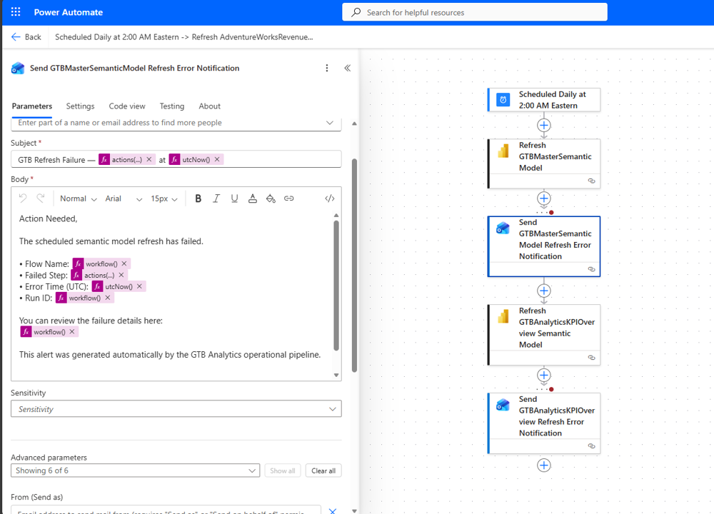

# 🔔 Power Automate

This folder is part of the Gulf to Bay Analytics modernization project.  
It contains assets, scripts, or resources related to **Microsoft Power Automate**, aligned with the overall goal of creating a clean, automated, cloud‑ready analytics ecosystem.

## Purpose

This folder contributes to the modernization effort by organizing work related to **workflow automation, semantic model refresh orchestration, and cross‑service integration** in a clear, maintainable structure.

## Contents

This folder may include:
- Cloud flow definitions  
- API and connection metadata  
- Automation logic for Power BI semantic model refresh  
- Supporting assets  

## Modernization Context

As part of the end‑to‑end modernization, this folder helps ensure:
- Clean separation of automation logic  
- Improved maintainability  
- Consistent documentation  
- Recruiter‑ready project organization  

### 🔔 Power Automate  
