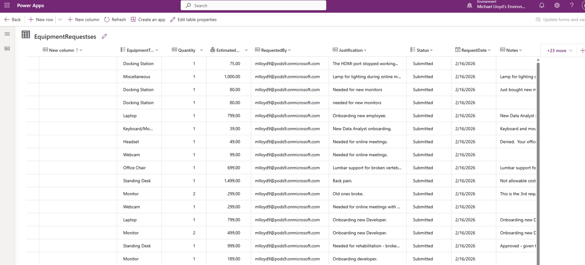

# 🟣🗄️ Dataverse

This folder is part of the Gulf to Bay Analytics modernization project.  
It contains assets, scripts, or resources related to **Microsoft Dataverse**, aligned with the overall goal of creating a clean, automated, cloud‑ready analytics ecosystem.

## Purpose

This folder contributes to the modernization effort by organizing work related to **data modeling, table structures, and solution packaging** in a clear, maintainable structure.

## Contents

This folder may include:
- Dataverse solutions  
- Table definitions  
- Supporting assets  

## Modernization Context

As part of the end‑to‑end modernization, this folder helps ensure:
- Clean separation of Dataverse components  
- Improved maintainability  
- Consistent documentation  
- Recruiter‑ready project organization  

### 🟪📁 Dataverse Table - Equipment Requests
