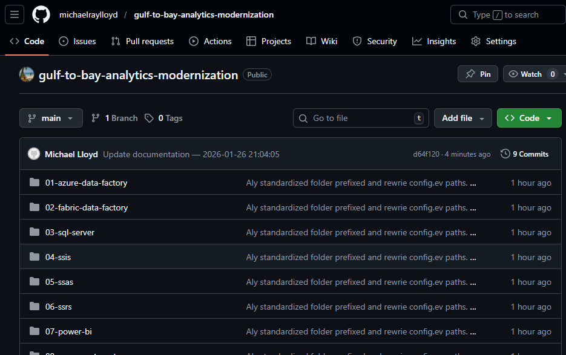
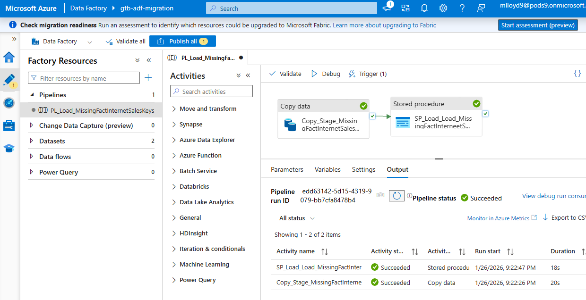
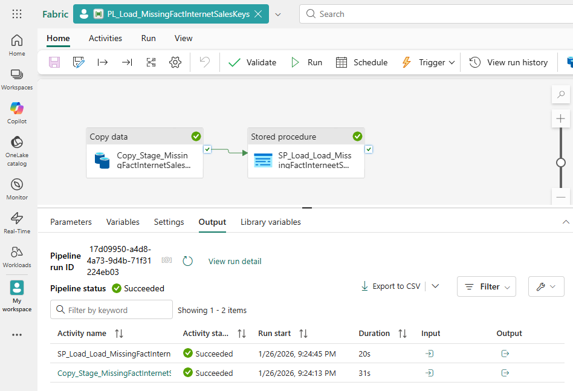

# Gulf to Bay Analytics — End‑to‑End BI Modernization  
### Portfolio Overview — Michael Lloyd, Business Intelligence Developer

---

## 1. Introduction

This document provides a visual, narrative walkthrough of the **Gulf to Bay Analytics Modernization Project**, demonstrating how a legacy Microsoft BI ecosystem was transformed into a clean, automated, cloud‑aligned analytics platform.

---

## 2. Legacy Environment Overview

The original environment ran on a traditional Microsoft BI stack — SQL Server, SSIS, SSAS, and SSRS — with manual refreshes, tightly coupled ETL packages, and fragmented logic spread across multiple tools. Pipelines lacked automation, documentation was minimal, and changes often required hands‑on intervention. The system worked, but it wasn’t scalable, cloud‑ready, or easy to maintain.

<strong>Expanded Legacy Environment Overview</strong>

The original Gulf to Bay Analytics environment operated on a traditional on‑premises Microsoft BI stack. While it delivered essential reporting, the architecture had accumulated technical debt over time and lacked the automation and scalability expected in a modern analytics platform.

Key characteristics included:

- **SQL Server** as the central data store, with business logic spread across stored procedures, views, and ad‑hoc scripts  
- **SSIS packages** responsible for nightly ETL, tightly coupled to server paths and sensitive to schema changes  
- **SSAS Tabular models** that required manual processing and lacked clear lineage back to source systems  
- **SSRS reports** maintained independently, each with its own datasets and refresh patterns  

Operational challenges:

- **Manual refresh cycles** requiring hands‑on intervention  
- **Fragmented pipelines** with duplicated logic across SQL, SSIS, and SSAS  
- **Limited automation**, making deployments slow and error‑prone  
- **Minimal documentation**, complicating onboarding and troubleshooting  
- **Tight coupling to on‑prem infrastructure**, limiting scalability and modernization options  

---

## 3. Modernization Goals

- Reduce manual processes  
- Improve data quality and lineage  
- Introduce cloud‑ready ETL  
- Build semantic models for Power BI  
- Automate refreshes  
- Improve documentation and maintainability  

<strong>Expanded Modernization Goals</strong>

The modernization effort focused on creating a scalable, maintainable, and cloud‑aligned analytics ecosystem. Key objectives included:

- **Decoupling business logic** from SSIS packages and embedding it in modular SQL and Python  
- **Improving transparency** through metadata‑driven design  
- **Migrating ETL** from SSIS to Fabric Data Factory and Python  
- **Rebuilding semantic models** to support Power BI’s modern capabilities  
- **Automating refreshes** using Power Automate  
- **Standardizing documentation** across the entire repo  

---

## 4. Repository Structure

The repository is organized into modular, prefixed folders that reflect the modernization flow:

| Prefix | Folder | Purpose |
|--------|--------|---------|
| **01‑** | azure‑data‑factory | Legacy ADF pipelines and assets |
| **02‑** | fabric‑data‑factory | Modern Fabric pipelines |
| **03‑** | sql‑server | SQL scripts, metadata, and database elements |
| **04‑** | ssis | Legacy ETL packages |
| **05‑** | ssas | Tabular model artifacts |
| **06‑** | ssrs | Reporting Services assets |
| **07‑** | power‑bi | PBIX files, M scripts, DAX, themes |
| **08‑** | power‑automate | Automated refresh flows |
| **09‑** | power‑apps | KPI Explorer app |
| **10‑** | python | ETL scripts and modular pipeline |
| **11‑** | powershell | Repo automation and documentation tooling |
| **12‑** | docs | Modernization notes, diagrams, and architecture |
| **13‑** | images | Branding and visual assets |

<strong>Expanded Repository Structure Notes</strong>

This structure ensures:

- Clear separation of legacy vs. modern components  
- Easy navigation for recruiters and engineers  
- Consistent documentation across all folders  
- A narrative flow that mirrors the modernization journey  

---

## 5. SQL Server Modernization

The SQL layer was restructured using metadata‑driven design, modular stored procedures, and standardized formatting (GTB SQL).

<strong>Expanded SQL Server Modernization Details</strong>

- Consolidated business logic into modular stored procedures  
- Applied GTB SQL formatting for readability and consistency  
- Documented schema, lineage, and dependencies  
- Reduced duplication across SSIS, SQL, and SSAS  

---

## 6. ETL Migration (SSIS → Azure Data Factory + Fabric Data Factory

#SQL SSIS - Server Integration Services

#Azure Data Fictory Pipelines

#Fabric Data Factory

The legacy SSIS packages were replaced with a modern ETL stack built on Python and Fabric Data Factory.

<strong>Expanded ETL Migration Details</strong>

- Extracted logic from SSIS and rebuilt it in Python  
- Introduced modular ETL scripts with reusable components  
- Implemented Fabric Data Factory pipelines for orchestration  
- Improved error handling, logging, and maintainability  

---

## 7. Semantic Modeling (SSAS → Power BI)

#SSAS - SQL Server Analysis Services

#

The semantic layer was rebuilt to support modern Power BI capabilities.

<strong>Expanded Semantic Model Details</strong>

- Rebuilt relationships and hierarchies  
- Standardized KPI definitions  
- Improved DAX readability and performance  
- Documented model structure and lineage  

---

## 8. Reporting & Dashboards

🔗 **Sample Gulf to Bay Analytics Dashboard**  
https://app.powerbi.com/view?r=eyJrIjoiNjEwZWU1M2UtMzhiZS00OTExLThmMjctNDczOGNmZmU5OWE0IiwidCI6ImE0MzI2YTU4LWY3ZDktNDQ0ZC1iM2FhLWIwOTAyN2U1ZTg2NiIsImMiOjF9

_[Screenshot Placeholder — Revenue Stream KPI Overview]_

<strong>Expanded Dashboard Notes</strong>

- Revenue trends across product lines  
- KPI performance vs. targets  
- Year‑over‑year comparisons  
- Drill‑through paths for deeper analysis  
- Clean, modern visuals aligned with Gulf to Bay branding  

---

## 9. Automation (Power Automate)

_[Screenshot Placeholder — Power Automate Flow]_

<strong>Expanded Automation Details</strong>

- Automated dataset refreshes  
- Added notifications for failures  
- Integrated with Fabric pipelines  
- Reduced manual intervention to zero  

---

## 10. Documentation & Repo Hygiene

_[Screenshot Placeholder — Git Sync Utility]_

<strong>Expanded Documentation Notes</strong>

- Auto‑generated folder‑level READMEs  
- Standardized naming conventions  
- PowerShell automation for repo maintenance  
- Clear narrative structure for recruiters  

---

## 11. Final Architecture Diagram

_[Screenshot Placeholder — Architecture Diagram]_

---

## 12. About the Developer

**Michael Lloyd**  
Business Intelligence Developer  
Gulf to Bay Analytics  
Clearwater, FL  

- SQL Server, SSIS, SSAS, SSRS  
- Python ETL  
- Fabric Data Factory  
- Power BI  
- Power Automate  
- Metadata‑driven design  
- Modernization strategy  

_[Screenshot Placeholder — Headshot or Branding]_

---

## 13. Contact

- GitHub: https://github.com/michaelraylloyd  
- LinkedIn: _Add your link here_  
- Email: _Add your email here_  

