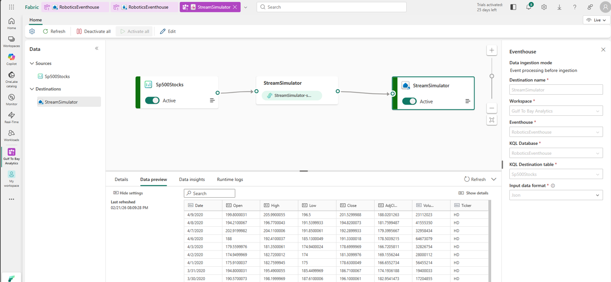
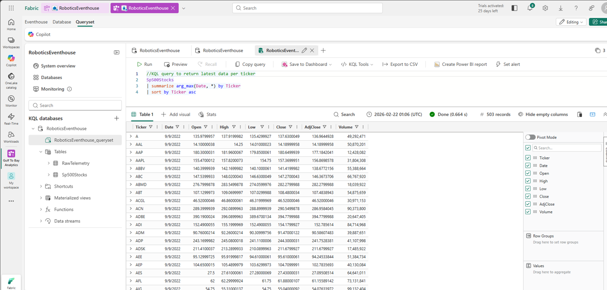

# 📡 Eventhouse

This folder is part of the Gulf to Bay Analytics modernization project.  
It contains assets, scripts, or resources related to **Microsoft Fabric Eventhouse**, aligned with the overall goal of creating a clean, automated, cloud‑ready analytics ecosystem.

## Purpose

This folder contributes to the modernization effort by organizing work related to **real‑time ingestion, telemetry simulation, and Eventhouse pipeline validation** in a clear, maintainable structure.

## Contents

This folder may include:
- Ingestion scripts  
- Telemetry generators  
- Eventhouse‑ready data payloads  
- Supporting assets  

## Modernization Context

As part of the end‑to‑end modernization, this folder helps ensure:
- Clean separation of real‑time ingestion logic  
- Improved maintainability  
- Consistent documentation  
- Recruiter‑ready project organization  

### 📡 Eventhouse - S&P 500 Eventstream

### 📡 Eventhouse - KQL Database
