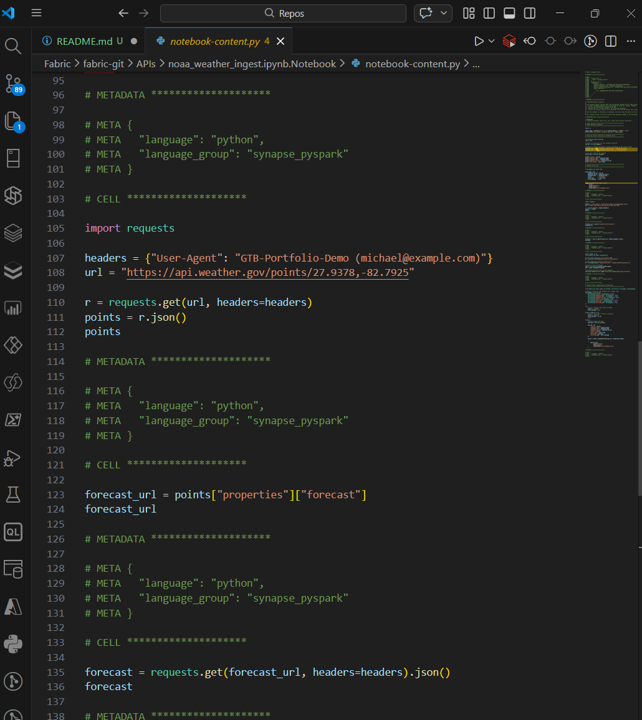
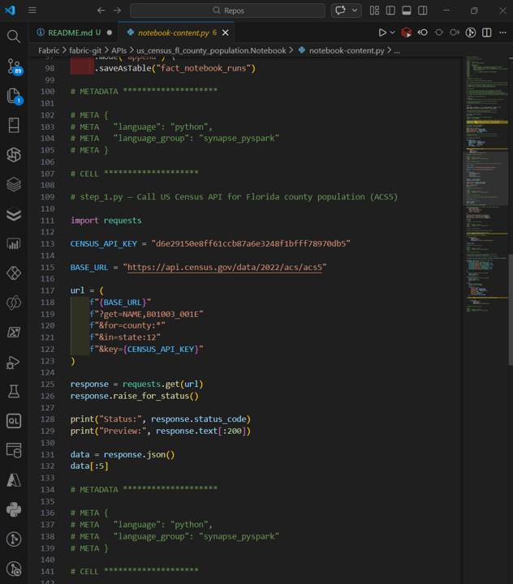

# 🔌 API Layer Overview

This folder introduces the API layer for the Gulf to Bay Analytics modernization project. It organizes all work related to consuming external services, integrating with internal enterprise APIs, and building new service endpoints that support operational workflows across the GTB ecosystem.

## Scope of the API Layer
APIs extend the modernization effort beyond data pipelines and semantic models by enabling:
- Integration with third‑party data sources.
- Secure access to internal operational systems.
- Service boundaries for business processes such as equipment requests and KPI adjustments.
- Closed‑loop analytics patterns where applications write back into the Lakehouse.

This folder provides the foundation for all three API competencies expected in modern data engineering roles.

## Folder Structure
The API layer is organized into three categories:

- **external/** — Examples of consuming third‑party APIs such as NOAA, Census, or OpenFDA. These demonstrate authentication, pagination, transformation, and ingestion into the Lakehouse or Snowflake.
- **internal/** — Examples of consuming internal enterprise APIs including Dataverse, Fabric, and Snowflake. These show secure access patterns, OAuth2 token acquisition, and integration with operational systems.
- **build/** — APIs developed as part of the GTB modernization project. These include the Equipment Request API, KPI Adjuster API, and shared authentication modules.

Each folder contains code samples, example payloads, and documentation that illustrate how APIs are used or implemented within the GTB ecosystem.

## Technical Highlights
- REST API consumption using Python or PowerShell  
- OAuth2 and API key authentication patterns  
- JSON normalization and ingestion into Delta or Snowflake  
- FastAPI or Azure Functions for API development  
- OpenAPI (Swagger) contract‑first design  
- Integration with Dataverse, Fabric Lakehouse, and Snowflake  
- Example consumers including Power Apps, Fabric pipelines, and Databricks notebooks  

## Dev → Prod Workflow
The API layer follows the same SDLC pattern as the rest of the modernization project:

1. Develop and test API logic in the **Dev** branch.  
2. Validate behavior in the **Dev** Fabric workspace or Dev API environment.  
3. Promote Dev → Main in Fabric.  
4. Deploy Main API to the Prod environment.  
5. (Optional) Pull Main to Prod on‑prem for archival or offline execution.

This ensures consistent, controlled promotion of API logic alongside data pipelines, semantic models, and application components.

### 🔌 API - NOAA Weather Ingest

### 🔌 API - FL Census Population by County
