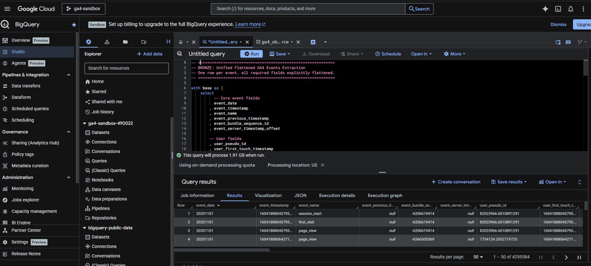
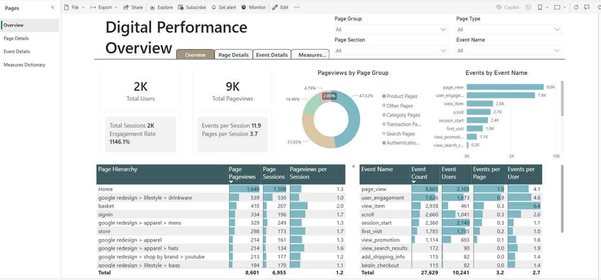

# 📊 Google Analytics (GA4) Pipeline Overview

This folder documents the end‑to‑end GA4 ingestion workflow for the Gulf to Bay Analytics modernization project. It demonstrates how raw Google Analytics 4 event data is exported, transformed, modeled, and delivered through a fully governed BI stack.

## Scope of the GA4 Pipeline
This pipeline showcases a complete, production‑ready analytics flow:

- GA4 export from BigQuery into structured CSV files.
- Bulk ingestion into **SQL Server On‑Prem** using a Bronze → Silver → Gold medallion pattern.
- Semantic modeling using **DAX** and **Power Query (M)**.
- Final delivery through a **Power BI workspace** for reporting and operational insights.

The goal is to provide a recruiter‑ready demonstration of modern data engineering patterns applied to a real digital analytics dataset.

## Folder Structure

- **csv/** — Raw GA4 export files used for Bronze ingestion.
- **sql/** — GTB‑formatted SQL scripts for Bronze, Silver, and Gold layers.
- (Supporting Power BI documents under 09-power-bi)
Each folder contains artifacts that illustrate a clean, repeatable, and modernization‑aligned analytics pipeline.

## Technical Highlights
- GA4 event flattening using BigQuery UNNEST patterns.
- Bronze → Silver → Gold modeling in SQL Server.
- Sessionization logic and engagement metrics.
- Power Query transformations for parameterized refresh.
- DAX measures for digital analytics KPIs.
- Power BI workspace deployment for final delivery.

## End‑to‑End Workflow

1. **GA4 → CSV Export**  
   Flattened GA4 events extracted from BigQuery and exported as CSV.

2. **CSV → SQL Server (Bronze)**  
   Raw events loaded into SQL Server with explicit schema control.

3. **SQL Server (Silver/Gold)**  
   Sessionization, rollups, and KPI modeling using GTB SQL formatting.

4. **Power BI (DAX + M)**  
   Semantic model, measures, and report pages built for delivery.

5. **Power BI Workspace**  
   Final dashboards published for consumption.

---

### 📊 GA4 Source

### 📈 GA4 Power BI Dashboard
