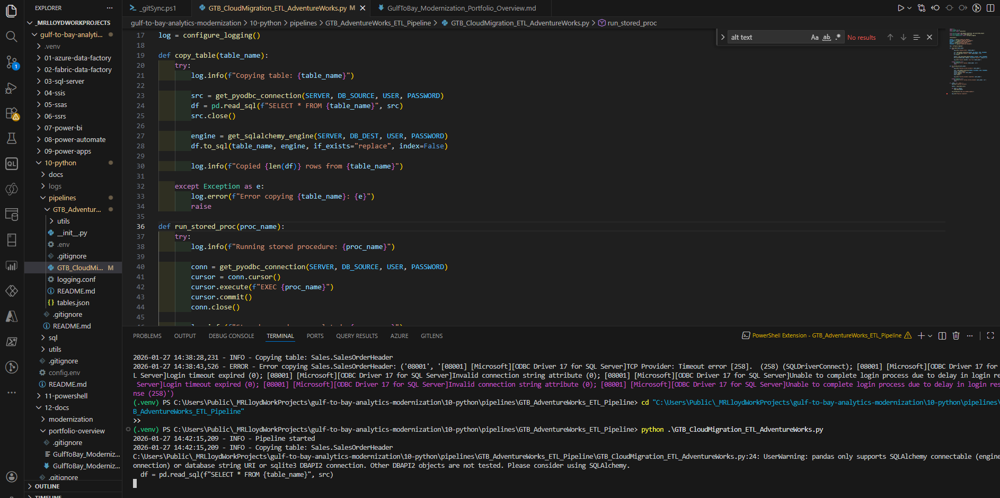
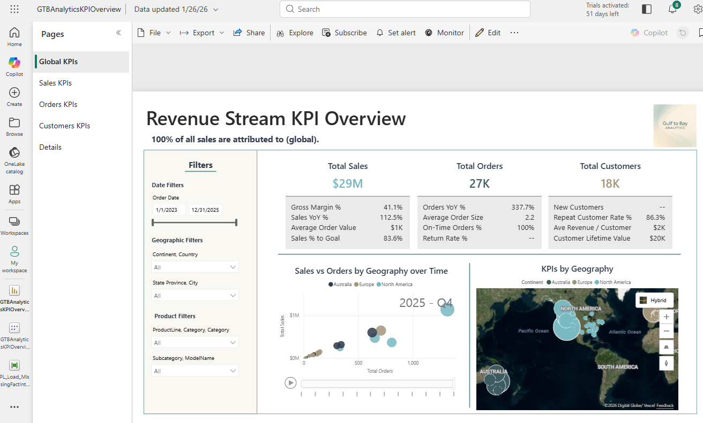
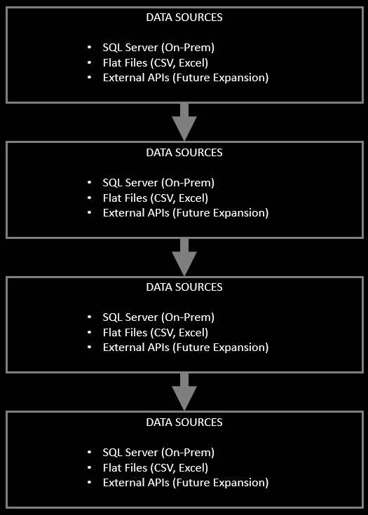

# Gulf to Bay Analytics — End‑to‑End BI Modernization  
### Portfolio Overview — Michael Lloyd, Business Intelligence Developer

---

## 1. Introduction

This document provides a visual, narrative walkthrough of the **Gulf to Bay Analytics Modernization Project**, demonstrating how a legacy Microsoft BI ecosystem was transformed into a clean, automated, cloud‑aligned analytics platform.

---

## 2. Legacy Environment Overview

The original environment ran on a traditional Microsoft BI stack — SQL Server, SSIS, SSAS, and SSRS — with manual refreshes, tightly coupled ETL packages, and fragmented logic spread across multiple tools. Pipelines lacked automation, documentation was minimal, and changes often required hands‑on intervention. The system worked, but it wasn’t scalable, cloud‑ready, or easy to maintain.

<strong>🏗️ Expanded Legacy Environment Overview</strong>

The original Gulf to Bay Analytics environment operated on a traditional on‑premises Microsoft BI stack. While it delivered essential reporting, the architecture had accumulated technical debt over time and lacked the automation and scalability expected in a modern analytics platform.

Key characteristics included:

- **SQL Server** as the central data store, with business logic spread across stored procedures, views, and ad‑hoc scripts  
- **SSIS packages** responsible for nightly ETL, tightly coupled to server paths and sensitive to schema changes  
- **SSAS Tabular models** that required manual processing and lacked clear lineage back to source systems  
- **SSRS reports** maintained independently, each with its own datasets and refresh patterns  

Operational challenges:

- **Manual refresh cycles** requiring hands‑on intervention  
- **Fragmented pipelines** with duplicated logic across SQL, SSIS, and SSAS  
- **Limited automation**, making deployments slow and error‑prone  
- **Minimal documentation**, complicating onboarding and troubleshooting  
- **Tight coupling to on‑prem infrastructure**, limiting scalability and modernization options  

---

## 3. Modernization Goals

- Reduce manual processes  
- Improve data quality and lineage  
- Introduce cloud‑ready ETL  
- Build semantic models for Power BI  
- Automate refreshes  
- Improve documentation and maintainability  

<strong>🏗️ Expanded Modernization Goals</strong>

The modernization effort focused on creating a scalable, maintainable, and cloud‑aligned analytics ecosystem. Key objectives included:

- **Decoupling business logic** from SSIS packages and embedding it in modular SQL and Python  
- **Improving transparency** through metadata‑driven design  
- **Migrating ETL** from SSIS to Fabric Data Factory and Python  
- **Rebuilding semantic models** to support Power BI’s modern capabilities  
- **Automating refreshes** using Power Automate  
- **Standardizing documentation** across the entire repo  

---

## 4. Repository Structure

The repository is organized into modular, prefixed folders that reflect the modernization flow:

<strong>🗂️ Expanded Repository Structure Notes</strong>

This structure ensures:

- Clear separation of legacy vs. modern components  
- Easy navigation for recruiters and engineers  
- Consistent documentation across all folders  
- A narrative flow that mirrors the modernization journey  

| Prefix | Folder | Purpose |
|--------|--------|---------|
| **01‑** | azure‑data‑factory | Legacy ADF pipelines and assets |
| **02‑** | fabric‑data‑factory | Modern Fabric pipelines |
| **03‑** | sql‑server | SQL scripts, metadata, and database elements |
| **04‑** | ssis | Legacy ETL packages |
| **05‑** | ssas | Tabular model artifacts |
| **06‑** | ssrs | Reporting Services assets |
| **07‑** | power‑bi | PBIX files, M scripts, DAX, themes |
| **08‑** | power‑automate | Automated refresh flows |
| **09‑** | power‑apps | KPI Explorer app |
| **10‑** | python | ETL scripts and modular pipeline |
| **11‑** | powershell | Repo automation and documentation tooling |
| **12‑** | docs | Modernization notes, diagrams, and architecture |
| **13‑** | images | Branding and visual assets |

---

## 5. SQL Server Modernization

The SQL layer was restructured using metadata‑driven design, modular stored procedures, and standardized formatting (GTB SQL).

<strong>🏗️ Expanded SQL Server Modernization Details</strong>

- Consolidated business logic into modular stored procedures  
- Applied GTB SQL formatting for readability and consistency  
- Documented schema, lineage, and dependencies  
- Reduced duplication across SSIS, SQL, and SSAS  

### 🔧 Modular Stored Procedure Architecture (GTB SQL Format)

---

## 6. ETL Migration (SSIS → Azure Data Factory + Fabric Data Factory)

The ETL layer was modernized by rebuilding legacy SSIS dataflows into cloud‑native pipelines using Azure Data Factory and Fabric Data Factory, creating a cleaner, more automated, and scalable orchestration framework.

<strong>⚙️ Expanded ETL Migration Details</strong>

- Extracted logic from SSIS and rebuilt it in Python  
- Introduced modular ETL scripts with reusable components  
- Implemented Fabric Data Factory pipelines for orchestration  
- Improved error handling, logging, and maintainability  

### ⚙️ SQL SSIS - Server Integration Services

### ⚙️ Azure Data Fictory Pipelines

### ⚙️ Fabric Data Factory

---

## 7. Semantic Modeling (SSAS → Power BI)

The semantic layer was rebuilt to support modern Power BI capabilities.

<strong>🔧 Expanded Semantic Model Details</strong>

- Rebuilt relationships and hierarchies  
- Standardized KPI definitions  
- Improved DAX readability and performance  
- Documented model structure and lineage  

### 🔧 SSAS - SQL Server Analysis Services

### 🔧 Power BI

---

## 8. Python ETL Pipeline — Cloud Migration & Data Synchronization

The modernization effort includes a Python‑based ETL pipeline that migrates and synchronizes data between Azure SQL environments. It powers the AdventureWorks dataset used throughout the Gulf to Bay Analytics platform.

<strong>🔧 Key Capabilities</strong>

- Pipeline Entry Point: `GTB_CloudMigration_ETL_AdventureWorks.py`
- Loads secure configuration from `.env`
- Connects to Azure SQL using pyodbc and SQLAlchemy
- Copies OLTP tables into the DW environment using modular, reusable components
- Executes stored procedures for downstream key‑management and processing
- Logs all activity for traceability, debugging, and repeatable cloud migrations
- Supports table‑level copy operations and metadata‑driven execution
- Provides a foundation for future orchestration (Airflow, Azure Data Factory, Fabric Data Factory)
- Demonstrates Python‑based ETL modernization within the Gulf to Bay Analytics platform

### 🔧 Python ETL Execution in VS Code

---

## 9. Reporting & Dashboards

This reporting layer delivers a suite of Power BI dashboards that surface revenue performance, customer behavior, and operational KPIs through clean, executive‑ready visuals.

<strong>📊 Dashboard Highlights & Design Notes</strong>

- Revenue trends across product lines  
- KPI performance vs. targets  
- Year‑over‑year comparisons  
- Drill‑through paths for deeper analysis  
- Clean, modern visuals aligned with Gulf to Bay branding  

🔗 **Sample Gulf to Bay Analytics Dashboard**  
https://app.powerbi.com/view?r=eyJrIjoiNjEwZWU1M2UtMzhiZS00OTExLThmMjctNDczOGNmZmU5OWE0IiwidCI6ImE0MzI2YTU4LWY3ZDktNDQ0ZC1iM2FhLWIwOTAyN2U1ZTg2NiIsImMiOjF9

### 📊 Revenue Stream KPI Overview - Global KPIs

### 📊 Revenue Stream KPI Overview - Sales KPIs

### 📊 Revenue Stream KPI Overview - Orders KPIs

### 📊 Revenue Stream KPI Overview - Customers KPIs

### 📊 Revenue Stream KPI Overview - Details

---

## 10. Automation (Power Automate)

Power Automate orchestrates the final stage of the modernization pipeline by automating dataset refreshes, integrating with Fabric workflows, and eliminating manual intervention.

<strong>⚙️ Expanded Automation Details</strong>

- Automated dataset refreshes  
- Added notifications for failures  
- Integrated with Fabric pipelines  
- Reduced manual intervention to zero  

### ⚙️ Power Automate Workflow Overview

---

## 11. Documentation & Repo Hygiene

This phase focused on creating a clean, maintainable repository through automated documentation, standardized naming conventions, and PowerShell tooling that keeps the entire project organized and recruiter‑ready.

<strong>🗂️ Expanded Documentation Notes</strong>

- Auto‑generated folder‑level READMEs  
- Standardized naming conventions  
- PowerShell automation for repo maintenance  
- Clear narrative structure for recruiters  

### 🗂️ PowerShell Automation & Repo Maintenance Tools

---

## 12. (Ongoing) Architecture Diagram

This high‑level architecture diagram illustrates the end‑to‑end flow of the Gulf to Bay Analytics modernization, connecting data sources, ETL pipelines, semantic modeling, reporting, and automation into a unified ecosystem.

<strong>🏗️ Architecture Overview & Design Notes</strong>

- Visualizes the full modernization flow from source systems to Power BI  
- Highlights the transition from legacy components to modern cloud‑aligned services  
- Shows how SQL, Python ETL, Fabric pipelines, and Power BI integrate  
- Provides a single reference point for recruiters and engineers reviewing the project  
- Continues to evolve as new components and enhancements are added  

### 🏗️ Modernization Architecture Overview

---

## 13. About the Developer

**Michael Lloyd**  
Business Intelligence Developer  
Gulf to Bay Analytics  
Clearwater, FL  

- SQL Server, SSIS, SSAS, SSRS  
- Python ETL  
- Fabric Data Factory  
- Power BI  
- Power Automate  
- Metadata‑driven design  
- Modernization strategy  

---

## 14. Contact

- GitHub: https://github.com/michaelraylloyd  
- LinkedIn: https://www.linkedin.com/in/michael-lloyd-7aa62250/
- Email: [mrlloyd9@gmail.com](mailto:mlloyd@gmail.com)