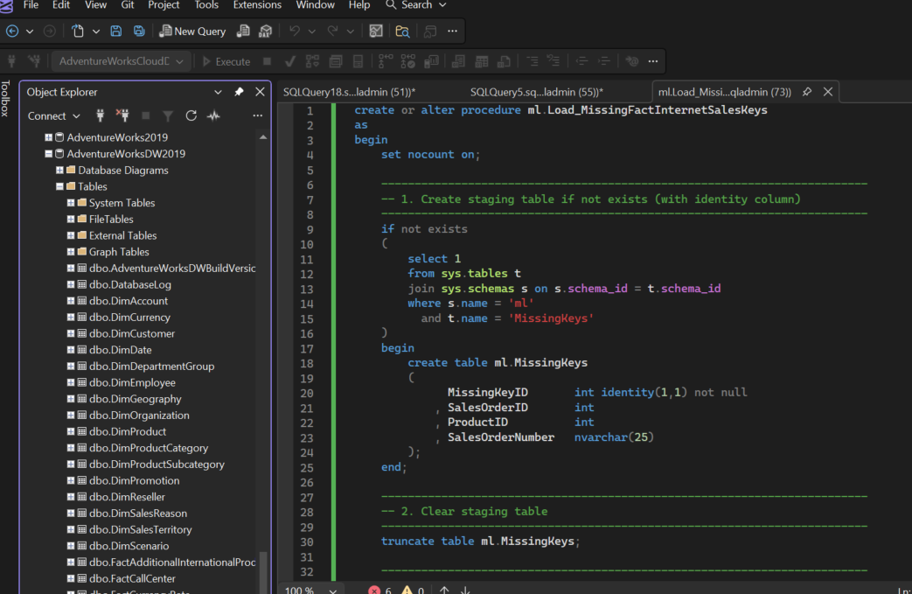
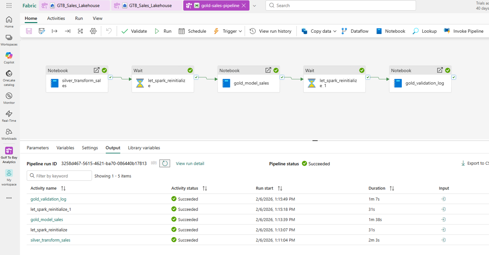
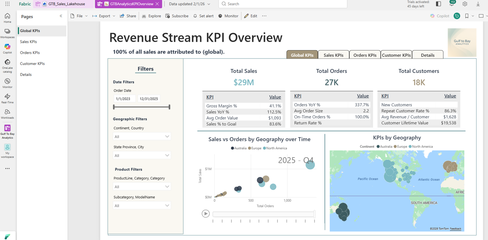
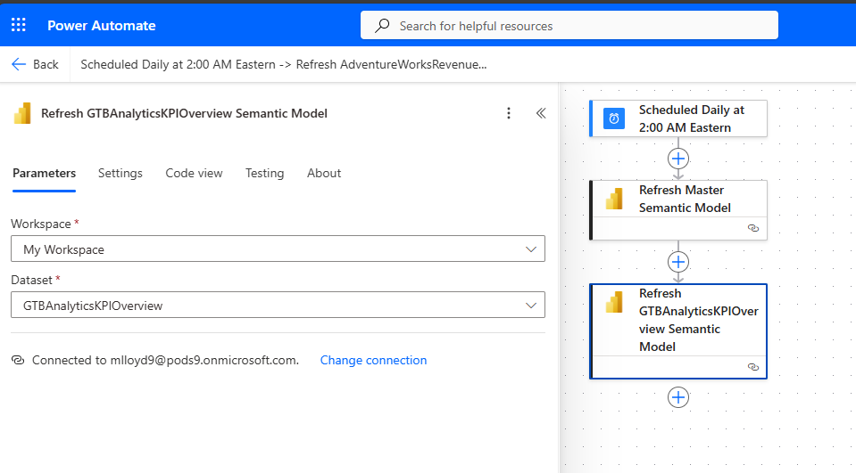
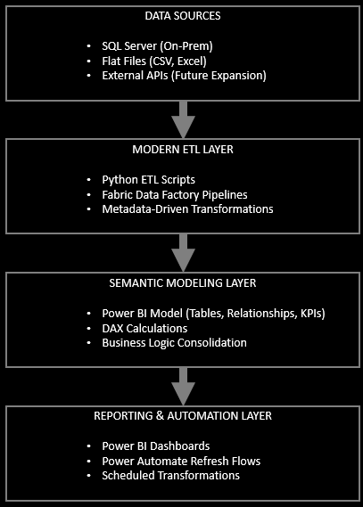

# Gulf to Bay Analytics — End‑to‑End BI Modernization  
### Portfolio Overview — Michael Lloyd, Business Intelligence Developer

---

## 1. Introduction

This document provides a visual, narrative walkthrough of the **Gulf to Bay Analytics Modernization Project**, demonstrating how a legacy Microsoft BI ecosystem was transformed into a clean, automated, cloud‑aligned analytics platform.

---

## 2. Legacy Environment Overview

The original environment ran on a traditional Microsoft BI stack — SQL Server, SSIS, SSAS, and SSRS — with manual refreshes, tightly coupled ETL packages, and fragmented logic spread across multiple tools. Pipelines lacked automation, documentation was minimal, and changes often required hands‑on intervention. The system worked, but it wasn’t scalable, cloud‑ready, or easy to maintain.

<strong>🏗️ Expanded Legacy Environment Overview</strong>

The original Gulf to Bay Analytics environment operated on a traditional on‑premises Microsoft BI stack. While it delivered essential reporting, the architecture had accumulated technical debt over time and lacked the automation and scalability expected in a modern analytics platform.

Key characteristics included:

- **SQL Server** as the central data store  
- **SSIS packages** for nightly ETL  
- **SSAS Tabular models** requiring manual processing  
- **SSRS reports** with independent datasets  

Operational challenges:

- Manual refresh cycles  
- Fragmented pipelines  
- Limited automation  
- Minimal documentation  
- Tight coupling to on‑prem infrastructure  

---

## 3. Modernization Goals

- Reduce manual processes  
- Improve data quality and lineage  
- Introduce cloud‑ready ETL  
- Build semantic models for Power BI  
- Automate refreshes  
- Improve documentation and maintainability  

<strong>🏗️ Expanded Modernization Goals</strong>

- Decouple business logic from SSIS  
- Improve transparency through metadata‑driven design  
- Migrate ETL to Fabric Data Factory and Python  
- Rebuild semantic models for Power BI  
- Automate refreshes with Power Automate  
- Standardize documentation across the repo  

---

## 4. Repository Structure

The repository is organized into modular, prefixed folders that reflect the modernization flow:

<strong>🗂️ Expanded Repository Structure Notes</strong>

This structure ensures:

- Clear separation of legacy vs. modern components  
- Easy navigation for recruiters and engineers  
- Consistent documentation  
- A narrative flow that mirrors the modernization journey  

| Prefix | Folder | Purpose |
|--------|--------|---------|
| **01‑** | azure‑data‑factory | Legacy ADF pipelines |
| **02‑** | fabric‑data‑factory | Modern Fabric pipelines |
| **03‑** | sql‑server | SQL scripts and metadata |
| **04‑** | ssis | Legacy ETL packages |
| **05‑** | ssas | Tabular model artifacts |
| **06‑** | ssrs | Reporting Services assets |
| **07‑** | power‑bi | PBIX files, M scripts, DAX |
| **08‑** | power‑automate | Automated refresh flows |
| **09‑** | power‑apps | KPI Explorer app |
| **10‑** | python | ETL scripts and pipelines |
| **11‑** | powershell | Repo automation tooling |
| **12‑** | docs | Modernization notes & diagrams |
| **13‑** | images | Visual assets |

---

## 5. SQL Server Modernization

The SQL layer was restructured using metadata‑driven design, modular stored procedures, and standardized formatting (GTB SQL).

<strong>🏗️ Expanded SQL Server Modernization Details</strong>

- Consolidated business logic  
- Applied GTB SQL formatting  
- Documented schema and lineage  
- Reduced duplication across SSIS, SQL, and SSAS  

### 🔧 Modular Stored Procedure Architecture (GTB SQL Format)

---

## 6. ETL Migration (SSIS → Azure Data Factory → Fabric Data Factory)

The ETL layer was modernized by rebuilding legacy SSIS dataflows into cloud‑native pipelines.

<strong>⚙️ Expanded ETL Migration Details</strong>

- Extracted logic from SSIS  
- Introduced modular Python ETL  
- Implemented Fabric Data Factory pipelines  
- Improved error handling and maintainability  

### ⚙️ SQL SSIS  

### ⚙️ Azure Data Factory  

### ⚙️ Fabric Data Factory  

---

## 7. Semantic Modeling (SSAS → Power BI)

The semantic layer was rebuilt to support modern Power BI capabilities.

<strong>🔧 Expanded Semantic Model Details</strong>

- Rebuilt relationships and hierarchies  
- Standardized KPIs  
- Improved DAX readability  
- Documented model structure  

### 🔧 SSAS  

### 🔧 Power BI  

---

## 8. Python ETL Pipeline — Cloud Migration & Data Synchronization

The modernization includes a Python‑based ETL pipeline that migrates and synchronizes data between Azure SQL environments.

<strong>🔧 Key Capabilities</strong>

- Loads secure config from `.env`  
- Connects to Azure SQL via pyodbc/SQLAlchemy  
- Copies OLTP tables into DW  
- Executes stored procedures  
- Logs activity for traceability  
- Metadata‑driven execution  

### 🔧 Python ETL Execution  

---

## 9. Lakehouse Architecture (Bronze → Silver → Gold)

The Lakehouse became the core of the modernized analytics platform.

<strong>🏗️ Expanded Lakehouse Architecture Details</strong>

- Bronze: Raw ingestion  
- Silver: Cleansed, typed, conformed  
- Gold: Star schema modeling  
- Surrogate keys & referential integrity  
- DQ validation & exception routing  

### 🪵 Lakehouse Architecture  

---

## 10. Fabric Pipelines — Unified Orchestration

Fabric Pipelines replaced fragmented SSIS/ADF logic with unified orchestration.

<strong>⚙️ Expanded Fabric Pipeline Details</strong>

- Preflight checks  
- Bronze → Silver → Gold  
- DQ validation  
- Semantic refresh  
- Exception routing  

### ⚙️ Fabric Pipeline  

---

## 11. Data Quality Subsystem (DQ)

A full DQ subsystem ensures data accuracy, completeness, and trustworthiness.

<strong>🧪 Expanded Data Quality Details</strong>

- Rule authoring lifecycle  
- expectations.json  
- Exception tables  
- SLA enforcement  
- SDLC integration  

### 🧪 Data Quality Architecture  

---

## 12. Reporting & Dashboards

This reporting layer delivers a suite of Power BI dashboards.

<strong>📊 Dashboard Highlights</strong>

- Revenue trends  
- KPI performance  
- YOY comparisons  
- Drill‑through paths  
- Modern visuals  

🔗 **Sample Dashboard**  
https://app.powerbi.com/view?r=eyJrIjoiNjEwZWU1M2UtMzhiZS00OTExLThmMjctNDczOGNmZmU5OWE0IiwidCI6ImE0MzI2YTU4LWY3ZDktNDQ0ZC1iM2FhLWIwOTAyN2U1ZTg2NiIsImMiOjF9

### 📊 KPI Dashboards  

---

## 13. Automation (Power Automate)

Power Automate orchestrates dataset refreshes and notifications.

<strong>⚙️ Expanded Automation Details</strong>

- Automated refresh  
- Failure notifications  
- Integration with Fabric  
- Zero manual intervention  

### ⚙️ Power Automate  

---

## 14. Power Apps — KPI Explorer & Operational Apps

Power Apps provides low‑code interfaces for business workflows.

<strong>📱 Expanded Power Apps Details</strong>

- KPI Explorer  
- Embedded Power BI  
- SQL + Dataverse hybrid  
- Approval workflows  

### 📱 Power Apps  

---

## 15. Documentation & Repo Hygiene

This phase focused on creating a clean, maintainable repository.

<strong>🗂️ Expanded Documentation Notes</strong>

- Auto‑generated READMEs  
- Standardized naming  
- PowerShell automation  
- Clear narrative structure  

### 🗂️ PowerShell Automation  

---

## 16. SDLC Evolution — From PowerShell Scripts to Branch‑Based CI/CD

The project evolved from manual PowerShell‑driven publishing to a clean, branch‑based SDLC that mirrors enterprise engineering.

<strong>🔧 SDLC Evolution Details</strong>

### Phase 1 — PowerShell Automation  
- Dev/Prod detection  
- Preflight validation  
- Manual `prodpublish` command  
- Repo sync automation  

### Phase 2 — Git Branching Model  
- Feature branches  
- Dev integration branch  
- Main as authoritative  
- GitKraken merge workflow  

### Phase 3 — CI/CD Ready  
- Deterministic promotion  
- Clean commit history  
- Architecture diagrams stored in `/12-docs`  
- Ready for GitHub Actions  

### 🔧 Branching Model  

---

## 17. PROD Release Milestone — 2026‑01‑29

This milestone marks the first fully validated and published PROD release.

<strong>📌 Highlights</strong>

- Clean Dev/Prod separation  
- Correct GitHub wiring  
- Manual PROD publishing workflow  
- Deterministic SDLC promotion  
- Public PROD repo reflects authoritative state  

### 🚀 Why This Matters  
This release transitions the project from *building* to *operating* the system.

---

## 18. Architecture Diagram

A high‑level architecture diagram illustrates the end‑to‑end modernization.

<strong>🏗️ Architecture Overview Notes</strong>

- Visualizes full modernization flow  
- Highlights legacy → modern transitions  
- Shows SQL, Python, Fabric, Power BI integration  
- Evolves as new components are added  

### 🏗️ Architecture Overview  

---

## 19. About the Developer

**Michael Lloyd**  
Business Intelligence Developer  
Gulf to Bay Analytics  
Clearwater, FL  

- SQL Server, SSIS, SSAS, SSRS  
- Python ETL  
- Fabric Data Factory  
- Power BI  
- Power Automate  
- Metadata‑driven design  
- Modernization strategy  

---

## 20. Contact

- GitHub: https://github.com/michaelraylloyd  
- LinkedIn: https://www.linkedin.com/in/michael-lloyd-7aa62250/  
- Email: [mrlloyd9@gmail.com](mailto:mrlloyd9@gmail.com)

---